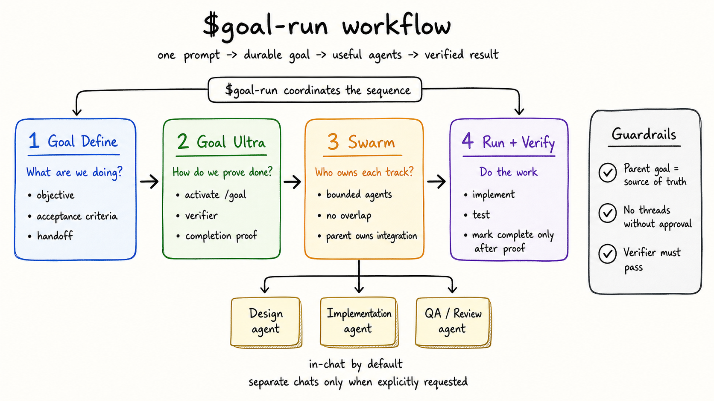

# Goal Run Workflow Skills

This package contains a local Codex skill workflow for turning a substantial objective into a durable Codex goal, activating it, and optionally delegating safe subwork.

Created by [Howdy Carter](https://howdycarter.com).



## Included Skills

- `goal-run`: one-shot wrapper that sequences the workflow.
- `goal-define`: turns fuzzy objectives into concrete goals, acceptance criteria, verifier, proof, and handoff.
- `goal-ultra`: activates or resumes durable goals with verifier, completion proof, blocker standard, and iteration loop.
- `swarm`: orchestrates authorized in-chat subagents or explicitly requested separate Codex threads after the parent goal exists.

## Install

Copy the included `skills` directories into your local Codex skills folder:

```sh
mkdir -p ~/.codex/skills
cp -R skills/goal-run skills/goal-define skills/goal-ultra skills/swarm ~/.codex/skills/
```

Restart or refresh Codex if the slash menu does not update immediately.

## Use

From chat:

```text
$goal-run Objective: [what you want done]
```

Or select `Goal Run` from the slash menu.

`goal-run` is designed to:

1. Use `goal-define` to clarify the objective.
2. Use `goal-ultra` to create or activate the persistent Codex goal when supported.
3. Use `swarm` for authorized subagents or explicitly requested separate chats when useful.
4. Continue through verification and completion proof instead of stopping at a plan.

## Thread Policy

The workflow uses in-chat subagents when authorized and useful. It creates separate Codex threads only when the user explicitly asks for other chats, separate threads, child chats, durable child threads, or similar.

## Diagram

An Excalidraw-style overview diagram is included at:

```text
docs/goal-run-workflow-excalidraw.png
```

A short launch teaser is included at:

```text
docs/goal-run-workflow-teaser.mp4
```

Launch copy and positioning notes are included in:

```text
launch/x-thread.md
launch/viral-launch-plan.md
```

## Creator

This workflow was created by [Howdy Carter](https://howdycarter.com) to make durable Codex goals easier to define, activate, delegate, and verify.
